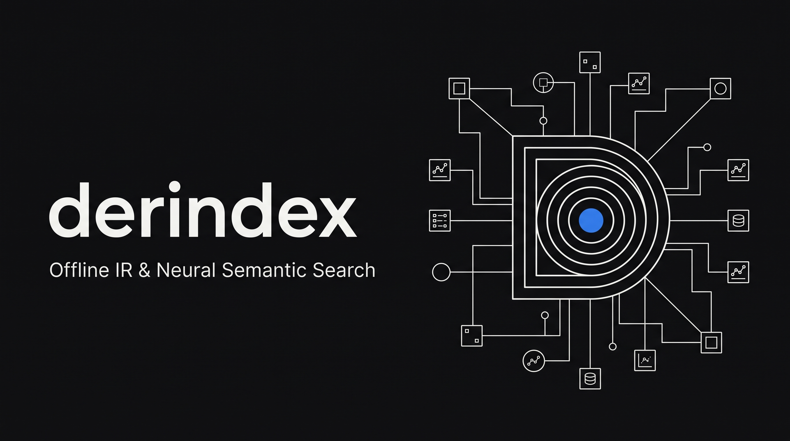
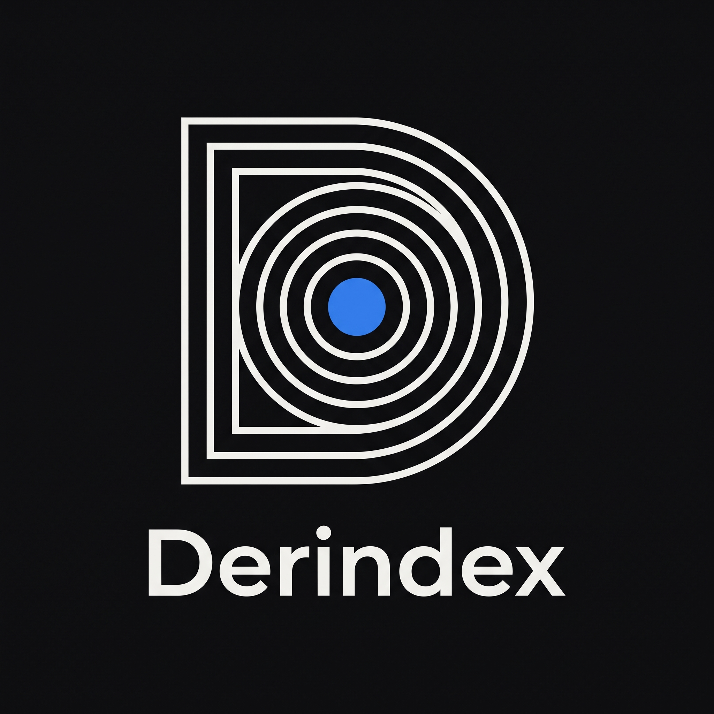
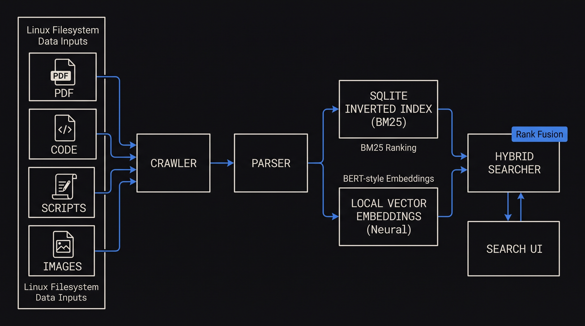
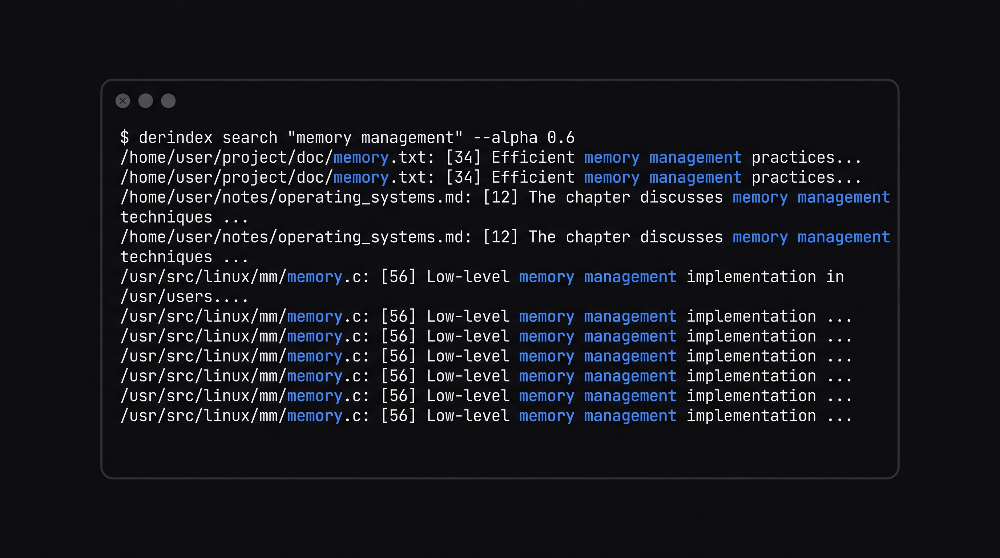

<p align="center">
  
</p>

<p align="center">
  
</p>

# Derindex: Derinlemesine Kişisel Arama Motoru ve Semantik Arama

[](https://www.python.org/)
[](LICENSE)
[](#-mimari-şema)
[](#-sistem-servisi-systemd)
[](#)

Linux laptoplar için Python ile geliştirilmiş, tamamen yerel (offline), hafif, güvenli ve deterministik çalışan gelişmiş bir **Kişisel Arama Motoru + Semantik Arama (Personal Search Engine + Semantic Search)** platformudur.

Harici hiçbir bulut servisine, üçüncü parti API'lara veya harici sunuculara bağımlı değildir. Klasik Information Retrieval algoritmalarını (Okapi BM25, Ters İndeks, TF-IDF) ve yerel vektör embedding benzerliğini birleştirerek doğrudan doğruya belgelerinizdeki en alakalı kısımları, satırları ve AST fonksiyonlarını milisaniyeler (<10ms) içinde bulur.

---

## 🏗 Mimari Şema

<p align="center">
  
</p>

```
                        Linux Dosya Sistemi
 (PDF, DOCX, PPTX, XLSX, ODF, Shell .sh, Kodlar, CSV, Görseller, Notlar)
                                 │
                                 ▼
                     Dosya Tarayıcı (Crawler)
         (Hassas dizin filtreleme: .ssh, .git, secrets)
                                 │
                                 ▼
                     Belge Ayrıştırıcı (Parsers)
    (Office XML, Slayt No, Kod AST, EXIF/Görsel, MD Hiyerarşisi)
                                 │
                                 ▼
                   Metadata + SHA-256 Sağlama
             (Artımlı/Incremental İndeksleme Kontrolü)
                                 │
                                 ▼
                    Akıllı Parçalama (Smart Chunking)
                                 │
         ┌───────────────────────┼───────────────────────┐
         ▼                       ▼                       ▼
    Ters İndeks            Okapi BM25            Yerel Vektörler
 (Inverted Index)       (k1=1.5, b=0.75)        (Dense Vectors)
  (SQLite Tabloları)      (TF/DF/avgdl)       (L2 Normalizasyonu)
         └───────────────────────┬───────────────────────┘
                                 │
                                 ▼
                           Hibrit Arama
         (final_score = alpha * BM25 + (1-alpha) * Semantic)
                                 │
                                 ▼
                   Yeniden Sıralama (Reranking)
             (RRF + Sembol ve Başlık Eşleşme Ağırlığı)
                                 │
                                 ▼
                      Arama Sonuçları
        - Eşleşen Metin Snippet'ı (Highlight)
        - Dosya Yolu, Sayfa / Slayt No ve Bölüm Adı
        - Kod Satır Aralıkları ve AST Sembolleri
        - BM25 & Semantik Skor Dağılımı
```

---

## 🌟 Temel Özellikler

1. **Özel Bilgi Erişimi Motoru (Custom IR Engine)**:
   - Sıfırdan yazılmış **Özel Tokenizer**: Türkçe karakter desteği ve kod sembolleri (`camelCase`, `snake_case`) ayrıştırma.
   - **Ters İndeks (Inverted Index)**: Terim sıklığı (TF) ve belge sıklığı (DF) hesaplamaları.
   - **Okapi BM25**: $k_1=1.5, b=0.75$ formülü ve belge uzunluğu normalizasyonu (`avgdl`).
   - **TF-IDF & Cosine Similarity**: Vektör uzayı hesaplayıcısı.

2. **Yerel Semantik Arama**:
   - Hafif yerel dense vektör embedding motoru (384-boyutlu L2 normalize vektör uzayı).
   - NumPy tabanlı yüksek performanslı vektör deposu (100.000+ parça üzerinde <10ms arama süresi).
   - Min-Max skor normalizasyonu ile BM25 ve Vektör benzerliğini birleştiren **Hibrit Skorlama**:
     $$\text{final\_score} = \alpha \cdot \text{bm25\_score} + (1 - \alpha) \cdot \text{semantic\_score}$$

3. **Gelişmiş Belge Ayrıştırma (Parsers & AST)**:
   - **Office Belgeleri**: `.docx` (Word), `.pptx` (PowerPoint slaytları), `.xlsx` (Excel tabloları), `.odt` / `.ods` / `.odp` (LibreOffice), `.rtf`, `.doc`.
   - **Görseller ve Vektörler**: `.png`, `.jpg`, `.jpeg`, `.webp`, `.svg` (SVG içi metinler, EXIF kamera/tarih bilgileri, çözünürlük ve semantik klasör etiketleri).
   - **Kabuk Script'leri ve Notebooks**: `.sh`, `.bash`, `.zsh`, `.fish` (fonksiyonlar, aliaslar, exportlar) ve `.ipynb` (Jupyter hücreleri).
   - **Programlama Dilleri**: Python AST, C/C++, Rust (`fn`, `struct`), Go (`func`, `type`), Java/Kotlin (`class`, `method`), SQL (`table`, `proc`), JavaScript/TypeScript.
   - **Veri ve Yapılandırma**: `.csv`, `.tsv` (satır ve sütun eşleşmesi), `.json`, `.yaml`, `.toml`, `.ini`, `.xml`, `.log`.
   - **PDF & Markdown**: `pypdf` sayfa no koruması ve Markdown başlık hiyerarşisi (`#`, `##`, `###`).

4. **Artımlı İndeksleme (Incremental Indexing & Watcher)**:
   - Her dosyanın **SHA-256** hash'i takip edilir. Değişmeyen dosyalar tekrar taranmaz ve vakit harcanmaz.
   - Silinen dosyalar otomatik olarak veritabanından ve vektör deposundan temizlenir.
   - `watch` komutu ile arka planda dosya sistemi izlenir (`watchdog`), değişiklik anında indeks güncellenir.

5. **Hafif, Güvenli ve Hızlı (Zero Overhead & Privacy First)**:
   - Sıfır bulut bağımlılığı, verileriniz asla bilgisayarınızdan dışarı çıkmaz.
   - Arka planda çalışırken yalnızca **~60 MB RAM** tüketir.

<p align="center">
  
</p>

---

## 🚀 Hızlı Kurulum

### Yöntem 1: Otomatik Kurulum (Önerilen)

Depoyu klonladıktan sonra tek bir komutla sanal ortamı kurabilir, bağımlılıkları yükleyebilir ve `derindex` komutunu sisteminize bağlayabilirsiniz:

```bash
git clone https://github.com/alperen/derindex.git
cd derindex
chmod +x setup.sh
./setup.sh
```

### Yöntem 2: Manuel Kurulum

```bash
# 1. Sanal ortam oluşturun ve aktif edin
python3 -m venv .venv
source .venv/bin/activate

# 2. Bağımlılıkları yükleyin
pip install -r requirements.txt

# 3. Global CLI bağlantısını yapın (isteğe bağlı)
mkdir -p ~/.local/bin
ln -sf $(pwd)/derindex ~/.local/bin/derindex
```

---

## 💻 CLI Kullanım Rehberi

<p align="center">
  
</p>

Terminalinizde herhangi bir klasördeyken doğrudan `derindex` komutunu kullanabilirsiniz:

```bash
# 1. Klasör İndeksleme
derindex index ~/Belgeler
derindex index ~/Projeler/kod-arsivim
derindex index data/demo_docs

# 2. Hibrit Arama (BM25 + Vektör Benzerliği)
derindex search "memory management"
derindex search "sanal bellek" --alpha 0.6 --limit 5

# 3. Yalnızca Kod Dosyalarında Arama
derindex code "allocate"

# 4. AST ile Fonksiyon / Sınıf / Sembol Arama
derindex symbol "MemoryManager"

# 5. İndeks ve Sistem Durumunu Görüntüleme
derindex stats
derindex status

# 6. Gerçek Zamanlı Klasör İzleme (Watcher)
derindex watch ~/Belgeler

# 7. İndeksleri Sıfırlama ve Yeniden Oluşturma
derindex rebuild

# 8. Web Arayüzünü Başlatma
derindex serve --port 8000
```

---

## 🌐 Web Arayüzü

Web arayüzü **Linear ve Vercel** tasarım standartlarında; nötr zinc/slate renk paleti, katı 8px grid sistemi, tek vurgulu mavi aksan ve minimalist kurumsal estetik ile tasarlanmıştır.

```bash
derindex serve --port 8000
```

Tarayıcınızdan **`http://localhost:8000`** adresine giderek:
- Anlık sonuç veren canlı arama motorunu kullanabilir,
- BM25 vs Semantik ağırlık dengesini (**Alpha slider**) gerçek zamanlı ayarlayabilir,
- Kod/Belge filtrelerini tek tıkla değiştirebilir,
- Eşleşen satır ve AST sembol detaylarını inceleyebilir,
- **System Stats** sekmesinden sistem durumunu izleyebilir ve doğrudan webden yeni klasör indeksleyebilirsiniz.

---

## ⚙️ Sistem Servisi (Systemd) Olarak Otomatik Çalıştırma

Bilgisayarınız açıldığında arka planda otomatik başlaması, dosya değişikliklerini izlemesi ve web arayüzünü sunması için hazır systemd servis script'i mevcuttur:

```bash
# Servisi kurun ve aktif edin
./scripts/install_service.sh

# Servisi başlatın
systemctl --user start derindex.service

# Durumunu kontrol edin
systemctl --user status derindex.service

# Canlı logları izleyin
journalctl --user -u derindex.service -f
```

*Not: Servis varsayılan olarak `MemoryMax=1.5G` ve `MemoryHigh=1G` güvenlik sınırlarıyla yapılandırılmıştır, sistem belleğinizi asla tüketmez.*

---

## 🧪 Testleri Çalıştırma

Tüm birim testleri yerel olarak çalıştırmak için:

```bash
python3 -m unittest discover tests -v
```

---

## 📂 Proje Yapısı

```
derindex/
├── assets/             # Kurumsal logo, banner, mimari ve CLI görsel varlıkları
├── app/
│   ├── cli/            # CLI komut satırı arayüzü (argparse, rich tablolar)
│   ├── crawler/        # Dizin tarayıcısı ve watchdog gerçek zamanlı izleyici
│   ├── database/       # SQLite şeması, bağlantı yöneticisi (WAL mode)
│   ├── embeddings/     # Dense embedding ve NumPy vektör deposu
│   ├── indexing/       # Özel Tokenizer, Ters İndeks, Okapi BM25, TF-IDF
│   ├── parsers/        # Office (DOCX/PPTX/XLSX/ODF), Image/EXIF, Code/AST, PDF, MD
│   ├── search/         # Hibrit skorlama (Alpha fusion) ve yeniden sıralayıcı (RRF)
│   └── web/            # FastAPI arka uç ve modern Vanilla CSS web arayüzü
├── data/
│   └── demo_docs/      # Test ve deneme için örnek dokümanlar
├── scripts/
│   ├── derindex.service    # Systemd kullanıcı servisi birim dosyası
│   └── install_service.sh  # Otomatik systemd servis kurulum scripti
├── tests/              # Kapsamlı birim test paketi
├── config.py           # Merkezi yapılandırma ve parametreler
├── derindex            # Doğrudan çalıştırılabilir CLI wrapper scripti
├── main.py             # Ana giriş noktası
├── requirements.txt    # Python bağımlılıkları
├── setup.sh            # Tek komutla ortam kurulum scripti
└── LICENSE             # MIT Açık Kaynak Lisansı
```

---

## 📄 Lisans

Bu proje [MIT Lisansı](LICENSE) altında lisanslanmıştır.
